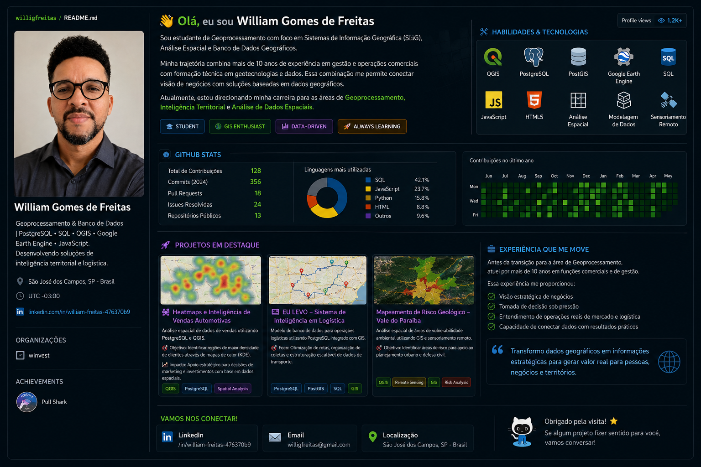

# Olá, eu sou o William Gomes de Freitas 👋

Sou especialista em **Inteligência Geográfica, Análise Espacial e Banco de Dados**. Minha trajetória une mais de 10 anos de experiência estratégica no setor comercial a uma sólida formação técnica em geotecnologias e desenvolvimento de dados. 

Essa fusão me permite traduzir desafios complexos de negócios, logística e mercado em soluções geoespaciais e modelos de dados eficientes, automatizados e visualmente claros.

---

### 🚀 O que eu trago para a mesa (Meus Argumentos de Valor)

* **Visão Estratégica & Comercial Baseada em Dados:** Mais de uma década atuando em posições comerciais me deu a habilidade de entender dores de mercado. Não vejo apenas tabelas ou mapas; eu enxergo oportunidades de expansão, otimização de frotas, comportamento de consumo e mitigação de riscos operacionais.
* **Geoprocessamento Avançado:** Capacidade de manipular, analisar e modelar dados geográficos complexos. Desenvolvimento de scripts para análise ambiental e fusão/classificação de imagens de satélite.
* **Modelagem e Engenharia de Dados:** Criação de bancos de dados relacionais robustos, aplicando regras de negócio diretamente no banco via SQL puro, triggers complexas e chaves estrangeiras, garantindo integridade e performance.

---

### 🛠️ Bagagem Tecnológica

| Categoria | Tecnologias e Ferramentas |
| :--- | :--- |
| **GIS & Sensoriamento Remoto** | QGIS, Google Earth Engine, SPRING, PostGIS, Processamento Digital de Imagens (PDI, NDVI) |
| **Banco de Dados & SQL** | PostgreSQL, pgAdmin, Modelagem de Dados, Triggers e Views |
| **Desenvolvimento Web** | HTML5, JavaScript (aplicado a mapas e automações web) |
| **Produtividade & Gestão** | ClickUp (Metodologias Ágeis e Gestão de Backlog) |

---

### 📂 Projetos em Destaque

#### 📌 1. Heatmaps e Inteligência Geográfica para Vendas Automotivas
* **O que faz:** Integração de banco de dados PostgreSQL e QGIS para analisar dados históricos de vendas e gerar mapas de calor (KDE). 
* **Impacto:** Permite que concessionárias e lojistas identifiquem com precisão cirúrgica a densidade de clientes, focando investimentos de marketing nas regiões de maior retorno.

#### 📌 2. Projeto "EU LEVO" – Inteligência de Dados em Transportes e Logística
* **O que faz:** Um modelo de dados modular em SQL integrado a capacidades GIS focado no setor de transportes.
* **Impacto:** Organização estrutural para otimização de rotas, controle de coletas e fluxos de entrega de forma escalável.

#### 📌 3. Mapeamento de Áreas de Risco Geológico no Vale do Paraíba
* **O que faz:** Projeto de análise socioambiental focado em identificar e classificar áreas de vulnerabilidade e risco geológico na região utilizando ferramentas GIS e sensoriamento remoto.
* **Impacto:** Geração de mapas temáticos cruciais para planejamento urbano e defesa civil.

---

### ⚡ No tempo livre...
Desafios intelectuais me movem. Quando não estou refinando queries ou ajustando composições coloridas em imagens de satélite, você provavelmente vai me encontrar estudando xadrez estratégico, ouvindo podcasts de clássicos da filosofia, curtindo um tempo com a familia.

---

### 🤝 Vamos nos conectar?
* **Localização:** São José dos Campos, SP - Brasil 📍
* [Meu LinkedIn]((https://www.linkedin.com/in/william-freitas-476370b9/)) 💼
